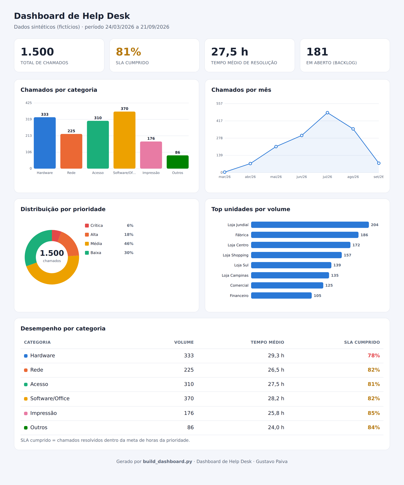

# Dashboard de Help Desk

> Painel que transforma o histórico de chamados de TI em indicadores de gestão: volume, SLA, tempo de resolução e onde estão os gargalos.


---

## Problema

Todo help desk gera um monte de chamados, mas o dado fica parado: ninguém enxerga quantos chamados entram, se o SLA está sendo cumprido, quanto tempo se leva para resolver ou quais setores mais abrem chamado. Sem essa visão, a gestão de TI age no escuro.

## Solução

Um dashboard que lê o histórico de chamados e responde as perguntas que o gestor faz:

- **Quantos chamados** entraram e quantos estão em aberto (backlog).
- **O SLA está sendo cumprido?** (percentual dentro da meta por prioridade).
- **Quanto tempo** se leva para resolver, em média (MTTR).
- **Onde estão os problemas:** volume por categoria, por mês, por prioridade e por unidade.

O relatório é um HTML **autossuficiente** — gráficos em SVG, sem dependência de JavaScript nem internet. Abre em qualquer navegador.

## Demonstração



> Gerado a partir de **1.500 chamados sintéticos** de 6 meses. Neste cenário: **81% de SLA cumprido**, **27,5 h** de tempo médio e **181 chamados** em aberto — com Hardware puxando o SLA para baixo (78%).

## Stack

- **Python** + **pandas** (leitura e agregação dos dados)
- Gráficos em **SVG inline** (barras, linha, donut, barras horizontais) — sem bibliotecas externas
- Paleta de cores validada para acessibilidade (daltonismo)

## Como usar

```bash
# 1. Instalar dependências
python -m pip install -r requirements.txt

# 2. Gerar os dados sintéticos (opcional — o CSV já vem no repo)
python generate_dataset.py

# 3. Construir o dashboard
python build_dashboard.py

# 4. Abrir
#    Windows:  start dashboard.html      |  Linux: xdg-open dashboard.html
```

## O que o dashboard mostra

| Indicador | O que responde |
|-----------|----------------|
| KPIs | Total, SLA cumprido, tempo médio de resolução, backlog |
| Chamados por categoria | Onde está o maior volume |
| Chamados por mês | Tendência ao longo do tempo |
| Distribuição por prioridade | Quanto é crítico x rotina |
| Top unidades | Quais setores/lojas mais abrem chamado |
| Desempenho por categoria | Volume, tempo médio e SLA de cada tipo |

## Como conectar com dados reais

Basta gerar um `data/tickets.csv` com as mesmas colunas (`id, aberto_em, fechado_em, categoria, prioridade, unidade, status, sla_horas, tempo_resolucao_h, sla_cumprido`) a partir do seu sistema de chamados — e rodar o `build_dashboard.py`. Casa bem com o [classificador de chamados](https://github.com/gustafpsdev), que preenche a categoria automaticamente.

## Aprendizados

- Modelagem de indicadores de service desk (SLA, MTTR, backlog).
- Agregação de dados com pandas (group by, séries temporais).
- Construção de gráficos do zero em SVG, sem depender de bibliotecas.
- Paleta de cores acessível (validada para daltonismo).

---

## Privacidade

Usa **apenas dados sintéticos** (`data/tickets.csv`), gerados por `generate_dataset.py`. Nenhum chamado real foi utilizado.

---

Feito por **Gustavo Paiva** · [LinkedIn](https://www.linkedin.com/in/gustavo-paiva-b38a22333)
